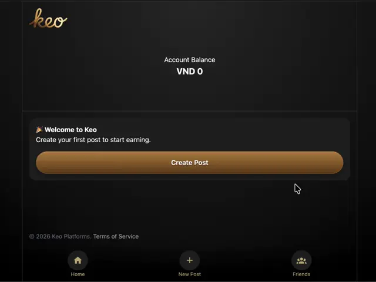

# Inertia X UI

A collection of Svelte components for [Inertia X](https://github.com/buhrmi/inertiax).

## Modal

The Modal component displays an [Inertia X Frame](https://github.com/buhrmi/inertiax#frame-component) within a modal. Here you can see the included default style (dark.css), which renders as a bottom sheet on mobile, and centered on the page on desktop.



### Creating a modal

You can programmatically create a Modal using the `createModal(props)` function. All passed props are handed down to the Frame component, in addition to a `close` function (see below). 

```js
import { createModal } from 'inertiax-ui'

const modal = createModal({
  src: '/profile/edit'
})
```

#### `modal` action

Inertia X UI also ships with a `modal` action. This is a small wrapper for `createModal` and passes the `href` attribute as the `src` prop.

```svelte
<script>
  import { modal } from 'inertiax-ui'
</script>

<a href="/profile/edit" use:modal>Edit profile</a>
```

### Closing a modal

The Modal component passes a `close` function down to its page component as a prop. You can call this function to close it. Behind the scenes, calling `close` will use the browsers Navigation API to traverse the history back to before the modal was opened, which in turn triggers callbacks that unmount the modal. Alternatively, you can call `close(false)` to close the modal without going back in history. This will prevent forward-navigation from re-opening the modal.

```svelte
<script>
  const { close } = $props()
</script>

<button onclick={close}>Close</button>
```

Note that there is no `close` function on the modal instance itself as components aren't usually able to unmount themselves.

## Installation

To start using Inertia X UI, install the `inertiax-ui` package and import the CSS style you'd like to use.

### Styling

Inertia X UI ships with a default [dark.css](./dark.css) style that displays the modal as a bottom sheet.

```js
import 'inertiax-ui/dark.css'
```

For full styling control, you can of course bring your own CSS. The key classes to target are:

| Class | Element |
|-------|---------|
| `.inx-modal_wrapper` | Full-screen overlay container |
| `.inx-modal_bg` | Clickable backdrop |
| `.inx-modal` | The modal panel itself |
| `.inx-spinner` | The loading animation spinner |

Additionally, Svelte injects a `--progress` variable with the current progress of the modal in- and out-transition (0 to 1). You can use it to create your own in- and out-transitions.